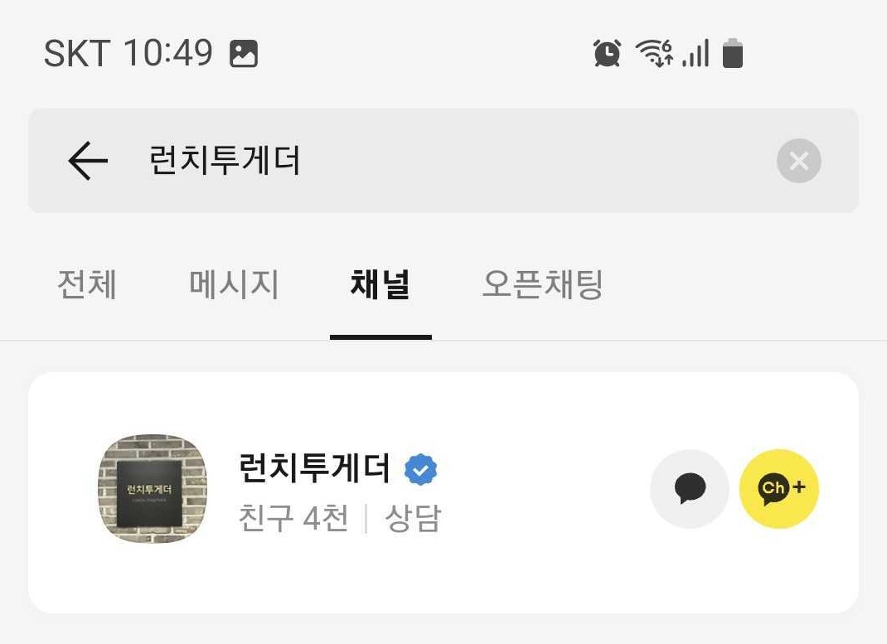
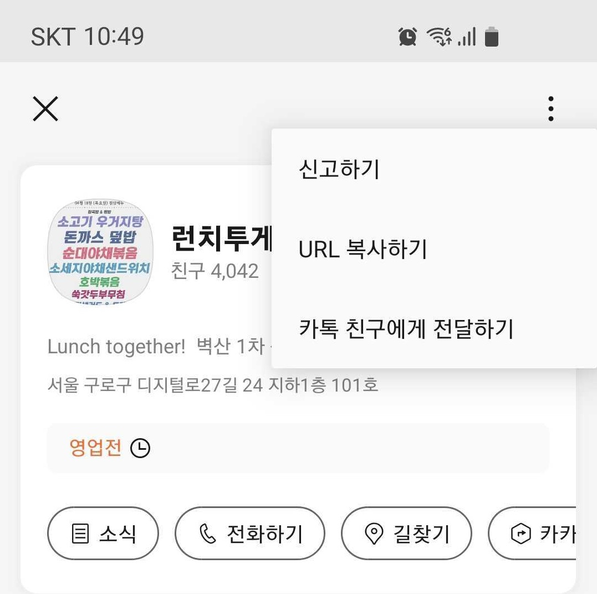

# 카카오톡 채널 프로필 이미지
카카오톡 채널에서 og meta 정보 `og:image` 공유 이미지를 가져와서 OCR을 통해 텍스트 추출 및 Slack 메세지 보내기

<p align="center">


<figcaption align="center">카카오톡 채널 검색 후 URL 복사하기</figcaption>
</p>

## mac

```bash
$ brew install tesseract
# 언어 추가 설치
$ brew install tesseract-lang
# 추출 가능한 언어 목록
$ tesseract --list-langs
```

## Ubuntu

```bash
$ sudo apt install tesseract-ocr
# 한글 설치
$ sudo apt-get install tesseract-ocr-kor
```

## Windows

https://github.com/UB-Mannheim/tesseract/wiki


## pip install

```bash
$ pip install -r requirements.txt
```

## local test

```bash
$ python kakaotalkchannel.py
```

## Docker Build

```bash
$ docker build -t kakaotalkchannel .
```

## docker test

```bash
$ docker run --rm -it kakaotalkchannel
```
